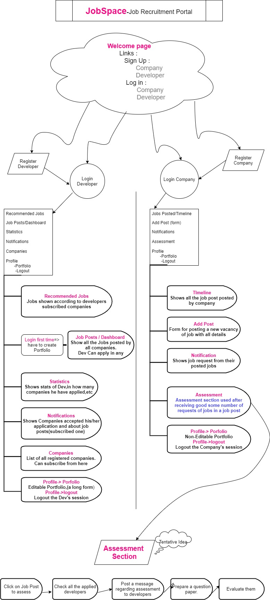

# JobSpace
### Project under 'Webster 2k20'
#### Team: **npm-i-confidence**
---

**About**
<br>
#### It's a **Full Stack** website dedicated for hiring developers and techies and a platform for recruiters to post job vacancies and can filter applications in further stages when developers portfolio selected and can also evaluate techies by quizzes / test.


**Hosted at :**  [Jobspace-webster2k20](https://jobspace-webster2k20.herokuapp.com/)
---

<!-- about ends here -->

**Tools and Technologies**
<br>
<code></code>
<code></code>
<code></code>
<code></code>

```
Javascript
Node.js
Express Backend Framework
Mongo Database
Bootstrap v4 Library
```

<!-- Tools and technologies ends here -->

<!-- Problem Statement -->

# **Features**
1. Login/ Signup for Developers and Companies.
2. OTP verification at sign up.
2. Each company to have its own page, where it can post relevant posts about company.
3. A different section on company page that has current job openings listed.
4. Developers should also have a page, where they can build their portfolio.
5. Developers should be able to subscribe to a company to get notified about latest openings.
6. Notification to developers when companies select their application.
7. Search section to search for companies. (Make this search easier for developers)
8. Ability to apply to an opening
9. Developers can see Stats of all their previous applications.
10. Companies can see Stats of all candidates that have applied for the current opening

1. Chatroom for developers as help desk
2. Recommend openings to developers as per they subscribe companies.
3. Filters for selection of candidates by companies after receiving applications (such as
minimum CPGA)
4. Assign developers a hidden score based on an evaluation test on joining the platform.
5. Sort the applications on the hidden score so that developers with high score have more chances to get shortlisted.
6. Prevent abuse of this testing criteria.
7. An assessment section where companies can organize test/quizzes for developers, in further
rounds, and can send test link to selected developers


<!-- workflow -->

# Workflow 
<code></code>

<!-- workflow ends here -->

### Team ~~Members~~ Member :
##### **Abhishek Vaishnav**
##### **20198003**


